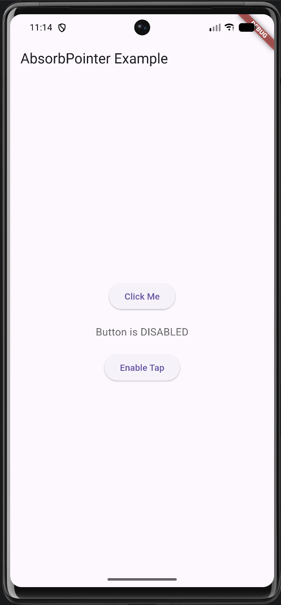
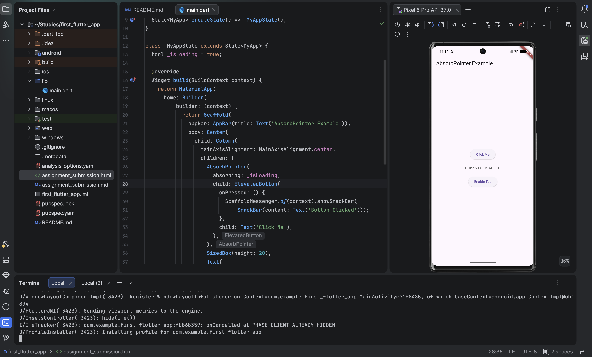

# AbsorbPointer

The Flutter AbsorbPointer widget acts as an invisible shield that disables all user interactions (clicks, drags, and swipes) for its subtree. It maintains your layout's exact visual state but completely intercepts pointer events, preventing the wrapped widget and anything beneath it from receiving touch events.

This project brings a tiny Flutter demo that shows how `AbsorbPointer` can block or allow taps on an `ElevatedButton` while a loading state is toggled.

## Run

1. Install Flutter dependencies with `flutter pub get`.
2. Start the app with `flutter run`.
3. Tap **Enable Tap** or **Disable Tap** to switch whether the button absorbs pointer events.

## Three Attributes

- `absorbing`: when `true`, the button stops receiving taps; when `false`, taps go through normally.
- `child`: the widget wrapped by `AbsorbPointer`; in this app it is the clickable `ElevatedButton`.
- `ignoringSemantics`: controls whether accessibility semantics are also absorbed when pointer input is blocked.

## Screenshot

## Demo Notes

The screen shows a button labeled **Click Me**, a status message that changes between disabled and enabled, and a control button that toggles the absorbing state.

# Presented On: 8th July 2026
